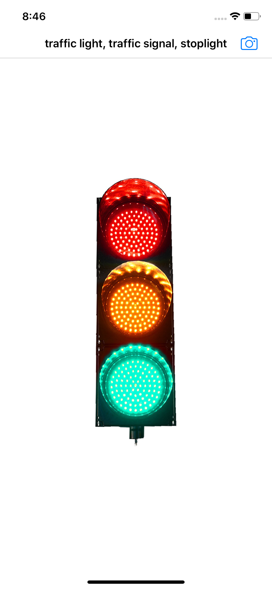
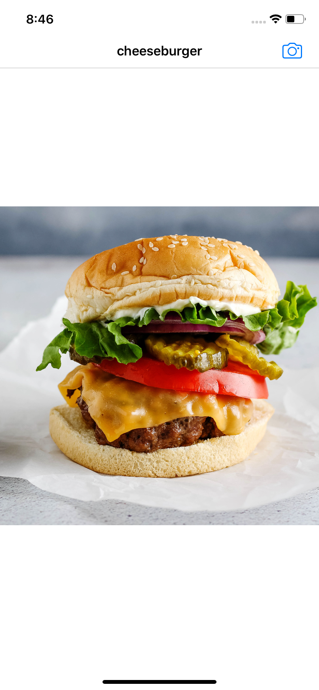

# CoreML Test App

App is using CoreML to classify the dominant object in an image.
Model for CoreML is SqueezeNet

## Screenshots

  Traffic light | Cheeseburger
  :-------------------------:|:-------------------------:
    |  
